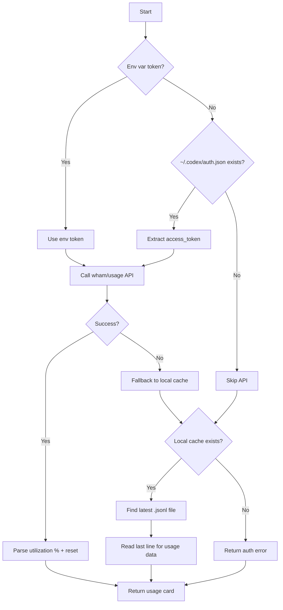

# ChatGPT Collector

**File:** `app/services/collectors/chatgpt.py`

ChatGPT Codex quota collector with OAuth-backed API and local session cache fallback.

---

## Overview

The ChatGPT collector retrieves quota information for ChatGPT Codex CLI usage, tracking utilization percentage across time windows with automatic fallback to locally cached session data.

### Key Features

- **Dual Token Sources**: Supports both environment variable and Codex CLI auth cache
- **Simple API Model**: Single endpoint returns utilization percentage and reset time
- **Local Cache Fallback**: Reads from Codex CLI session logs when API unavailable
- **Time-Based Windows**: Tracks primary/secondary usage windows with reset timestamps

---

## Data Sources

### 1. Primary: ChatGPT wham/usage API (OAuth)

**Endpoint:**

| Endpoint | Purpose | Auth | Response |
|----------|---------|------|----------|
| `chatgpt.com/backend-api/wham/usage` | Get usage utilization | Bearer token | `primary`, `secondary` windows |

**Authentication:**
- Credentials priority:
  1. `CHATGPT_OAUTH_TOKEN` environment variable
  2. `~/.codex/auth.json` (Codex CLI cache)

**Token Retrieval:**

```python
# Priority 1: Environment variable
token = os.getenv("CHATGPT_OAUTH_TOKEN")

# Priority 2: Codex CLI auth cache
auth_path = os.path.expanduser("~/.codex/auth.json")
# Format: {"tokens": {"access_token": "eyJ..."}}
```

### 2. Secondary: Local Session Cache

**Location:** `~/.codex/sessions/*.jsonl`

**Fallback Trigger:** API failure, no token, or network error

**Data Parsed:**
- `used_percent` - Utilization percentage from last session
- `resets_at` - Unix timestamp of quota reset
- Latest file selected by modification time (mtime)

---

## Collection Flow



---

## Authentication Sources

### Environment Variable

```bash
export CHATGPT_OAUTH_TOKEN="eyJhbGciOiJ..."
```

Highest priority - checked first before attempting to read files.

### Codex CLI Auth Cache

**Path:** `~/.codex/auth.json`

**Format:**
```json
{
  "tokens": {
    "access_token": "eyJhbGciOiJ...",
    "refresh_token": "def50200...",
    "expires_at": 1775570736
  }
}
```

The collector extracts `tokens.access_token` for Bearer authentication.

---

## API Response Format

### wham/usage Response

```json
{
  "primary": {
    "utilization_percent": 45.5,
    "resets_at": 1775570736,
    "window_type": "rolling"
  },
  "secondary": {
    "utilization_percent": 12.3,
    "resets_at": 1776089136,
    "window_type": "monthly"
  }
}
```

### Field Mapping

| API Field | Display Value | Notes |
|-----------|---------------|-------|
| `utilization_percent` | `% used` → `% remaining` | `100 - pct` shown as remaining |
| `resets_at` | Reset time display | Unix seconds → "Resets in Xh Ym" |
| `window_type` | (not shown) | "rolling" or "monthly" |

**Note:** Only the `primary` window is currently displayed. The secondary window provides additional context but isn't surfaced in the UI.

---

## Local Cache Format

### Session File Structure

**Path:** `~/.codex/sessions/<session-id>.jsonl`

**Format:** NDJSON (Newline Delimited JSON), one entry per line

**Example:**
```jsonl
{"timestamp": 1775484336, "used_percent": 23.5, "resets_at": 1775570736}
{"timestamp": 1775487936, "used_percent": 45.0, "resets_at": 1775570736}
```

### Cache Reading Logic

1. Glob all `**/*.jsonl` files in `~/.codex/sessions`
2. Select file with most recent `mtime` (modification time)
3. Read last line (most recent entry)
4. Parse JSON for `used_percent` and `resets_at`

---

## Health Calculation

Based on **utilization percentage**:

```python
if pct < 80:
    health = "good"      # Green
else:
    health = "warning"   # Yellow
```

**Note:** Unlike other collectors, ChatGPT doesn't have a "critical" threshold. The API only provides utilization percentage without quota limits, so we use a simple two-state health indicator.

---

## Output Format

### API Mode (Primary)

```python
{
    "service": "ChatGPT Codex",
    "icon": "💬",
    "remaining": "54.5%",        # 100 - utilization_percent
    "unit": "remaining",
    "reset": "Resets in 4h 30m",  # From resets_at timestamp
    "health": "good",             # Based on utilization
    "pace": "Stable",             # From PaceCalculator
    "detail": "API: wham/usage"
}
```

### Cache Fallback Mode

```python
{
    "service": "ChatGPT Codex",
    "icon": "💬",
    "remaining": "55.0%",
    "unit": "remaining",
    "reset": "Resets in 4h 25m",
    "health": "good",
    "pace": "Stable",
    "detail": "45.0% used [Cache]"
}
```

**Cache Indicator:** The detail field shows the actual used percentage with a `[Cache]` tag to indicate fallback data.

---

## Troubleshooting

### Issue: "No logs/auth" error

**Cause:** No token available and no local cache files

**Fix:**
1. Set environment variable:
   ```bash
   export CHATGPT_OAUTH_TOKEN="your-token"
   ```
2. Or install and authenticate Codex CLI:
   ```bash
   npm install -g @openai/codex
   codex auth login
   ```

### Issue: "API Error"

**Cause:** Token exists but API call failed

**Check:**
```bash
# Test token manually
curl -H "Authorization: Bearer $CHATGPT_OAUTH_TOKEN" \
     https://chatgpt.com/backend-api/wham/usage
```

**Fix:**
- Token may be expired - re-authenticate with Codex CLI
- Check network connectivity
- Verify token hasn't been revoked

### Issue: "Parse Error"

**Cause:** Local cache files are corrupted or empty

**Fix:**
```bash
# Clear corrupted cache
rm -rf ~/.codex/sessions/*.jsonl

# Re-run codex to generate new session logs
codex
```

### Issue: Usage percentage seems wrong

**Cause:** Cache may be stale

**Check:** Look at the detail field:
- `"API: wham/usage"` - Live data from API
- `"45.0% used [Cache]"` - Cached data (may be outdated)

**Fix:** Ensure API token is configured for live data.

---

## Future Options

### Potential: Web Dashboard Scraping (Tertiary Fallback)

**What it is:** The ChatGPT web interface at `https://chatgpt.com/codex/settings/usage` shows detailed usage charts, rate limits, and credits that aren't available via the API.

**Implementation approach:**
```python
async def _collect_via_web_scraping(self, client: httpx.AsyncClient) -> List[Dict[str, Any]]:
    """Tertiary fallback: Scrape ChatGPT web dashboard."""
    # Option 1: Manual cookie input (for headless/Docker)
    cookie_header = os.getenv("CHATGPT_COOKIE_HEADER")
    
    # Option 2: Automatic cookie extraction (macOS only)
    cookie = get_chatgpt_cookie_from_browser()  # Safari/Chrome/Firefox
    
    if not cookie:
        return []
    
    url = "https://chatgpt.com/codex/settings/usage"
    headers = {"Cookie": cookie}
    resp = await client.get(url, headers=headers)
    # Parse HTML/JSON for usage data, rate limits, credits
    ...
```

**Data available via web scraping:**
- Detailed usage charts (daily/weekly breakdown)
- Rate limit headers (requests per minute)
- Credit balance (for paid tiers)
- Model-specific usage breakdown

**Pros:**
- No OAuth token required (uses session cookies)
- Richer data than API endpoint
- Works even when API is rate-limited

**Cons:**
- Fragile (HTML structure changes)
- Requires browser cookies (session-based)
- Slower (HTTP page fetch vs API call)
- Cookie extraction complex across browsers
- May violate Terms of Service

**Comparison:**

| Method | Requires | Data Quality | Speed | Reliability |
|--------|----------|--------------|-------|-------------|
| OAuth API | Bearer token | ⭐⭐⭐ Usage % | Fast | High |
| Session Cache | Log files | ⭐⭐ Cached % | Fast | Medium |
| Web Scraping | Cookies | ⭐⭐⭐⭐ Rich data | Slow | Low |

**Decision:** **Not implemented currently.** The OAuth API covers the primary use case well, and the local cache provides sufficient fallback. Web scraping adds significant complexity and maintenance burden.

**If needed in future:** Would slot as a tertiary fallback between API and cache:
```
OAuth API → Web Scraping (detailed data) → Session Cache (cached %)
```

**Related:** See `docs/ideas.md` line 175 for the original proposal.

---

## Related Files

| File | Purpose |
|------|---------|
| `app/services/collectors/chatgpt.py` | Main collector implementation |
| `scripts/sidecar.py` | Sidecar version (sync API) |
| `app/core/config.py` | `CHATGPT_SESSIONS_DIR` configuration |
| `tests/unit/test_collectors.py` | Unit tests |

---

## References

- **Codex CLI:** https://github.com/openai/codex
- **OpenAI Platform:** https://platform.openai.com

---

*Last updated: 2026-04-07*

## Troubleshooting

### Issue: "No Auth" error
**Cause:** No token or cookie found
**Fix:**
1. Set `CHATGPT_OAUTH_TOKEN` env var
2. Or login to ChatGPT in Chrome (allows cookie extraction)
3. Or check `~/.codex/auth.json` exists

### Issue: "401 Unauthorized"
**Cause:** Token expired
**Fix:**
1. Re-login to https://chat.openai.com
2. Extract new token from cookies
3. Or use `~/.codex/auth.json` refresh

### Issue: Local logs not found
**Cause:** Codex CLI not used recently
**Fix:**
1. Use Codex CLI: `codex ...`
2. Check `~/.codex/sessions/` exists
3. Or rely on web API method

