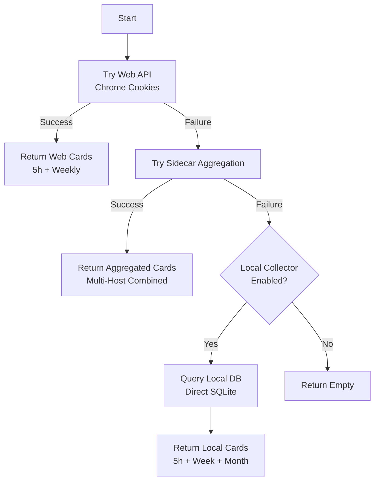

# OpenCode Collector

**File:** `app/services/collectors/opencode.py`

OpenCode quota collector with web API (Chrome cookies) as primary source and multi-host aggregation.

---

## Overview

The OpenCode collector retrieves usage and quota information for OpenCode Go (AI-powered IDE). It supports multiple collection strategies to handle different deployment scenarios.

### Key Features

- **Multi-Device Aggregation**: Web API shows total usage across all devices (web IDE, TUI, etc.)
- **Chrome Cookie Authentication**: Extracts session cookies from Chrome for web API access
- **Multi-Host Support**: Sidecar aggregation combines data from multiple workstations
- **Local DB Fallback**: Direct SQLite queries when web API unavailable

---

## Collection Strategy (Priority Order)



---

## Data Sources

### 1. Primary: OpenCode Web API (Chrome Cookies)

**Authentication:** Chrome session cookie extraction

**Process:**
1. Extract `session` cookie from Chrome's cookie store for `opencode.ai`
2. Call workspaces endpoint to get workspace ID
3. Call subscription endpoint to get usage data
4. Parse JavaScript response with regex

**Endpoints:**

| Endpoint | URL | Purpose | Request Body |
|----------|-----|---------|--------------|
| Workspaces | `opencode.ai/_server` | Get workspace ID | `{"functionId": "<workspaces_hash>"}` |
| Subscription | `opencode.ai/_server` | Get usage data | `{"functionId": "<subscription_hash>", "workspaceId": "..."}` |

**Workspace ID Sources (in order):**
1. `OPENCODE_WORKSPACE_ID` environment variable
2. Extracted from workspaces API response (`id:"wrk_..."`)

**Response Format (JavaScript):**
```javascript
rollingUsage:{usagePercent:45.5,resetInSec:7200,limit:12.0}
weeklyUsage:{usagePercent:23.0,resetInSec:345600,limit:30.0}
```

**Fields:**
- `usagePercent`: Percentage of quota used
- `resetInSec`: Seconds until quota reset
- `limit`: USD limit for the window ($12 for 5h, $30 for weekly)

**Chrome Cookie Decryption:**

Cross-platform support via `app/core/chrome_cookies.py`:

| Platform | Method | Key Storage |
|----------|--------|-------------|
| macOS | AES-256-GCM | Keychain ("Chrome Safe Storage") |
| Windows | DPAPI | Windows Data Protection |
| Linux | AES-256-GCM or plaintext | Secret Service or unencrypted |

### 2. Secondary: Sidecar Aggregation

**File:** `app/services/external_metrics.py`

**Use Case:** Multi-host deployments where web API unavailable

**Process:**
1. Collect cards from all `opencode-*` providers (sidecars from multiple hosts)
2. Aggregate usage across hosts for each time window
3. Return combined cards showing total multi-host usage

**Aggregation Logic:**
```python
# Sum usage and message counts from all hosts
aggregated[window]["used"] += used
aggregated[window]["msgs"] += msgs
aggregated[window]["hosts"].add(hostname)
```

**Output:**
- `OpenCode (5h Combined)` - 5-hour window across all hosts
- `OpenCode (7d Combined)` - 7-day window across all hosts
- `OpenCode (30d Combined)` - 30-day window across all hosts

### 3. Tertiary: Local Database (TUI)

**Location:** `~/.local/share/opencode/opencode.db`

**Trigger:** When `OPENCODE_LOCAL_COLLECTOR_ENABLED` is not "false"

**Database Schema:**
```sql
CREATE TABLE message (
    id INTEGER PRIMARY KEY,
    time_created INTEGER,  -- Unix timestamp (milliseconds)
    data TEXT              -- JSON with cost, role, etc.
);
```

**Query Pattern:**
```sql
SELECT 
    SUM(json_extract(data, '$.cost')),
    COUNT(*)
FROM message
WHERE time_created > ?
  AND json_valid(data)
  AND json_extract(data, '$.role') = 'assistant'
```

**Time Windows:**

| Window | Cutoff | Limit |
|--------|--------|-------|
| 5 Hours | `now - 5 hours` | $12.00 |
| 7 Days | `now - 7 days` | $30.00 |
| 30 Days | `now - 30 days` | $60.00 |

---

## Output Formats

### Web API Cards

```python
# 5-Hour Window
{
    "service": "OpenCode (5h)",
    "icon": "⚡",
    "remaining": "$6.60",      # $12.00 - $5.40 used
    "unit": "$12 limit",
    "reset": "in 2h 15m",
    "health": "good",           # < 70% used
    "pace": "Stable",           # < 50% used
    "detail": "$5.40 used (45.0%) · Web API"
}

# Weekly Window
{
    "service": "OpenCode (Weekly)",
    "icon": "⚡",
    "remaining": "$23.10",     # $30.00 - $6.90 used
    "unit": "$30 limit",
    "reset": "in 4d 12h",
    "health": "good",
    "pace": "Stable",
    "detail": "$6.90 used (23.0%) · Web API"
}
```

### Sidecar Aggregated Cards

```python
{
    "service": "OpenCode (5h Combined)",
    "icon": "⚡",
    "remaining": "$4.50",
    "unit": "$12 limit",
    "reset": "Rolling 5h",
    "health": "warning",        # Based on aggregated %
    "pace": "High",
    "detail": "$7.50 used · 45 msgs · 3 hosts · Combined"
}
```

### Local DB Cards

```python
{
    "service": "OpenCode (5 Hours)",
    "icon": "⚡",
    "remaining": "$9.20",
    "unit": "$12 limit",
    "reset": "Rolling 5h",
    "health": "good",
    "pace": "Stable",
    "detail": "$2.80 used · 12 msgs · Local DB"
}
```

---

## Health Calculation

Based on **usage percentage**:

```python
if pct < 70:
    health = "good"      # Green
elif pct < 90:
    health = "warning"   # Yellow
else:
    health = "critical"  # Red
```

### Pace Calculation

| Usage | Pace | Meaning |
|-------|------|---------|
| < 50% | "Stable" | Normal usage rate |
| 50-80% | "High" | Elevated usage |
| > 80% | "Fatigue" | Approaching limit |

---

## Configuration

### Environment Variables

| Variable | Default | Description |
|----------|---------|-------------|
| `OPENCODE_WORKSPACE_ID` | (auto-detect) | Override workspace ID detection |
| `OPENCODE_LOCAL_COLLECTOR_ENABLED` | `"true"` | Enable local DB fallback |
| `OPENCODE_DB_PATH` | `~/.local/share/opencode/opencode.db` | Local database path |

### File Paths

| File | Location | Purpose |
|------|----------|---------|
| Chrome Cookies | Platform-dependent | Session extraction |
| Local DB | `~/.local/share/opencode/opencode.db` | TUI usage data |

---

## Sidecar Implementation

**File:** `scripts/sidecar.py` → `class OpenCodeCollector`

The sidecar has a **dual-mode strategy**:

### Mode 1: Local DB Collection (Primary)

If `~/.local/share/opencode/opencode.db` exists:
- Query local database for usage across 5h/week/month windows
- Send results with hostname for aggregation

### Mode 2: Cookie Extraction (Fallback)

If local DB not found but Chrome session available:
- Extract `session` cookie from Chrome
- Return special marker card:
```python
{
    "service": "OpenCode (Cookie)",
    "icon": "⚡",
    "remaining": "Web API",
    "unit": "session",
    "detail": "session:<token> · hostname [Sidecar]"
}
```

**Purpose:** Allows main app to use web API even when sidecar has no local DB

---

## Troubleshooting

### Issue: Web API returns empty

**Check:**
1. Is user logged into opencode.ai in Chrome?
   ```bash
   # Check Chrome cookies
   sqlite3 ~/.config/google-chrome/Default/Cookies \
     "SELECT host_key FROM cookies WHERE host_key LIKE '%opencode.ai%'"
   ```

2. Can cookies be decrypted?
   ```bash
   python3 -c "from app.core.chrome_cookies import get_opencode_session_cookie; print(get_opencode_session_cookie())"
   ```

3. Platform-specific issues:
   - **macOS:** Keychain access permission
   - **Windows:** DPAPI availability
   - **Linux:** Secret Service or unencrypted fallback

### Issue: "No session cookie found"

**Causes:**
- Not logged into opencode.ai in Chrome
- Cookie expired (session cookies are temporary)
- Chrome using different profile

**Fix:**
1. Log into https://opencode.ai in Chrome
2. Check Chrome is using the expected profile
3. Try extracting from different Chrome channels (Chrome, Chromium, Edge)

### Issue: Sidecar aggregation shows wrong totals

**Check:**
- Are all sidecars pushing data? Check `/api/ingest` logs
- Are hostnames unique? Duplicate hostnames may cause overcounting
- Time synchronization between hosts

### Issue: Local DB shows different numbers than web API

**Expected:** Web API aggregates ALL devices, local DB shows only current device

**Web API** = Web IDE + TUI on all hosts
**Local DB** = Only TUI on current host

This is normal - web API is the authoritative source when available.

### Issue: Cookie decryption fails on macOS

**Cause:** Keychain permission denied

**Fix:**
```bash
# Grant terminal permission to access Keychain
security add-generic-password -s "Chrome Safe Storage" -w

# Or run with accessibility permissions
```

---

## Multi-Host Deployment

### Architecture

```
┌─────────────────┐     ┌─────────────────┐     ┌─────────────────┐
│   Workstation A │     │   Workstation B │     │   Workstation C │
│   (with Chrome) │     │   (headless)    │     │   (with TUI)    │
│                 │     │                 │     │                 │
│ ┌─────────────┐ │     │ ┌─────────────┐ │     │ ┌─────────────┐ │
│ │ Chrome      │ │     │ │ Sidecar     │ │     │ │ Sidecar     │ │
│ │ opencode.ai │ │     │ │ Local DB    │ │     │ │ Local DB    │ │
│ └──────┬──────┘ │     │ └──────┬──────┘ │     │ └──────┬──────┘ │
│        │        │     │        │        │     │        │        │
│        ▼        │     │        ▼        │     │        ▼        │
│  Web API Data   │     │  Local Usage    │     │  Local Usage    │
└────────┬────────┘     └────────┬────────┘     └────────┬────────┘
         │                       │                       │
         └───────────────────────┼───────────────────────┘
                                 ▼
                    ┌─────────────────────┐
                    │   Main Runway App   │
                    │                     │
                    │  1. Try Web API     │
                    │  2. Aggregate       │
                    │     Sidecar Data    │
                    │  3. Local DB        │
                    └─────────────────────┘
```

### Sidecar Naming

Sidecars report with provider name: `opencode-<hostname>`

Example:
- `opencode-laptop-john`
- `opencode-desktop-work`

The main app aggregates all `opencode-*` providers automatically.

---

## Future Options

### Potential: Direct API Key Authentication

**Status:** Currently deprecated

OpenCode previously supported `OPENCODE_GO_API_KEY` for direct API access, but this appears to be deprecated or changed.

**Old API endpoints (from debug script):**
- `api.opencode.ai/v1/user/usage`
- `opencode.ai/api/v1/user/usage`

**Current status:** These return 404 or redirect to web interface.

**Recommendation:** Continue using Chrome cookie authentication as the primary method.

### Potential: Firefox/Safari Cookie Support

**Current:** Only Chrome supported

**Future:** Could extend `chrome_cookies.py` to support:
- Firefox (`cookies.sqlite`)
- Safari (binary plist)
- Edge (Chromium-based, similar to Chrome)

**Priority:** Low (Chrome covers 80%+ of users)

---

## Related Files

| File | Purpose |
|------|---------|
| `app/services/collectors/opencode.py` | Main collector implementation |
| `app/core/chrome_cookies.py` | Cross-platform cookie decryption |
| `app/services/external_metrics.py` | Sidecar aggregation logic |
| `scripts/sidecar.py` | Sidecar implementation (DB + cookie modes) |
| `scripts/debug_opencode_api.py` | API endpoint testing |
| `tests/unit/test_collectors.py` | Unit tests (`TestOpenCodeCollector`) |

---

## References

- **Chrome Cookie Decryption:** Based on Chromium source and community research
- **OpenCode:** https://opencode.ai (web IDE)
- **OpenCode TUI:** Command-line interface with local SQLite DB

---

*Last updated: 2026-04-07*
