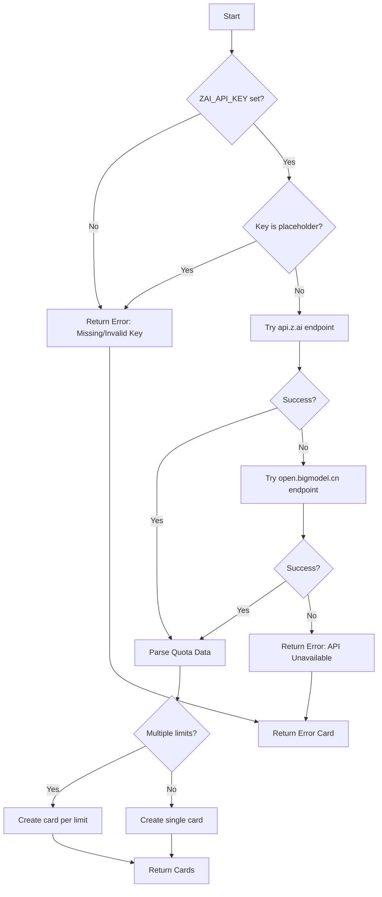

# zAI Plan Collector (Quota)

**File:** `app/services/collectors/zai_plan.py`

Zhipu AI (GLM) quota collector with token and time limit tracking.

> **Note:** This collector tracks quota limits. For prepaid balance, see [zAI API Collector](zai_api.md).

---

## Overview

The zAI Plan collector retrieves quota limits from Zhipu AI's GLM models. Unlike the balance-based API, this endpoint returns plan-based limits including token quotas and time windows.

### Key Features

- **Quota-Based Model**: Shows token and time limits (not prepaid balance)
- **Multiple Limits**: Can return both TOKENS_LIMIT and TIME_LIMIT cards
- **Plan Detection**: Extracts plan name from response
- **Multi-Endpoint**: Tries api.z.ai first, falls back to open.bigmodel.cn
- **Reset Tracking**: Shows when limits reset

---

## Data Source

### Primary: Zhipu AI Quota API

**Primary Endpoint:** `https://api.z.ai/api/monitor/usage/quota/limit`

**Fallback Endpoint:** `https://open.bigmodel.cn/api/monitor/usage/quota/limit`

**Authentication:** Bearer token via `ZAI_API_KEY` environment variable (same as zai_api)

**Response Format:**
```json
{
  "data": {
    "planName": "Basic Plan",
    "limits": [
      {
        "type": "TOKENS_LIMIT",
        "limit": 1000000,
        "used": 450000,
        "nextResetTime": 1775570736000
      },
      {
        "type": "TIME_LIMIT",
        "limit": 3600,
        "used": 1800,
        "nextResetTime": 1775570736000
      }
    ]
  }
}
```

**Limit Types:**
- `TOKENS_LIMIT`: Token-based quota (e.g., 1M tokens)
- `TIME_LIMIT`: Time-based quota (e.g., 3600 minutes)

---

## Collection Flow



---

## Output Format

### Token Limit Card

```python
{
    "service": "zAI Plan (Tokens)",
    "icon": "📊",
    "remaining": "550,000",      # limit - used
    "unit": "1,000,000 limit",
    "reset": "Plan cycle",
    "health": "warning",          # 45% used
    "pace": "Stable",
    "detail": "450,000 used · Basic Plan"
}
```

### Time Limit Card

```python
{
    "service": "zAI Plan (Time)",
    "icon": "📊",
    "remaining": "1,800",        # limit - used
    "unit": "3,600 min",
    "reset": "Plan cycle",
    "health": "good",             # 50% used
    "pace": "Stable",
    "detail": "1,800 min used · Basic Plan"
}
```

### Error Card (No Limits)

```python
{
    "service": "zAI Plan",
    "icon": "📊",
    "remaining": "ERR",
    "unit": "Check State",
    "reset": "—",
    "health": "critical",
    "pace": "Stopped",
    "detail": "No Limits Found"
}
```

---

## Health Calculation

Based on **percentage used**:

```python
if pct_used < 50:
    health = "good"      # Green
elif pct_used < 80:
    health = "warning"   # Yellow
else:
    health = "critical"  # Red
```

---

## Configuration

### Environment Variables

| Variable | Required | Description | Example |
|----------|----------|-------------|---------|
| `ZAI_API_KEY` | Yes | Zhipu AI API key | `sk-abc123...` |

> **Note:** Uses same key as zai_api collector.

### Getting an API Key

Same as zai_api: https://open.bigmodel.cn/

---

## Comparison: zAI API vs zAI Plan

| Aspect | zAI API (Balance) | zAI Plan (Quota) |
|--------|-------------------|------------------|
| **Endpoint** | `/users/me/balance` | `/usage/quota/limit` |
| **Returns** | Prepaid balance (¥) | Token/time quotas |
| **Model** | Pay-as-you-go | Plan-based limits |
| **Reset** | Manual (add funds) | Plan cycle |
| **Multiple cards** | No (1 card) | Yes (1-2 cards) |
| **Use case** | Track spending | Track usage limits |

---

## Deployment Modes

### Standalone
Works directly with API key from environment. No local files needed.

### Multi-Host
Run sidecar on each machine with `ZAI_API_KEY` set.

### Docker
Set `ZAI_API_KEY` as environment variable in container.

---

## Troubleshooting

### Issue: "API Unavailable" error

**Cause:** Both endpoints failed

**Check:**
```bash
curl -H "Authorization: Bearer $ZAI_API_KEY" \
  https://api.z.ai/api/monitor/usage/quota/limit
curl -H "Authorization: Bearer $ZAI_API_KEY" \
  https://open.bigmodel.cn/api/monitor/usage/quota/limit
```

### Issue: "No Limits Found" error

**Cause:** Plan has no configured limits or API response format changed

**Fix:** Verify your plan includes quotas (some basic plans may be balance-only)

---

## Related Files

| File | Purpose |
|------|---------|
| `app/services/collectors/zai_plan.py` | Main collector implementation |
| `app/services/collectors/zai_api.py` | Balance collector (complementary) |
| `app/core/config.py` | API key configuration |
| `tests/unit/test_collectors.py` | Unit tests (TestZaiPlanCollector) |

---

## References

- **Zhipu AI Documentation:** https://open.bigmodel.cn/dev/howuse/model
- **GLM Models:** ChatGLM series (GLM-4, GLM-4-Plus, etc.)

---

*Last updated: 2026-04-07*
